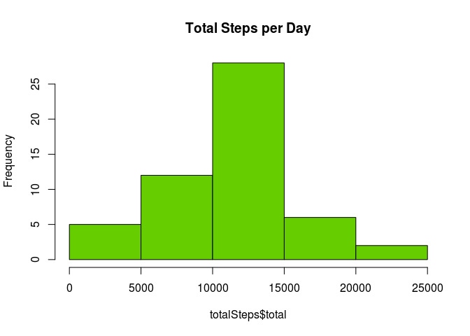
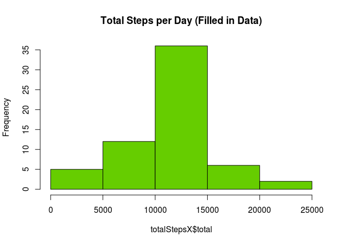
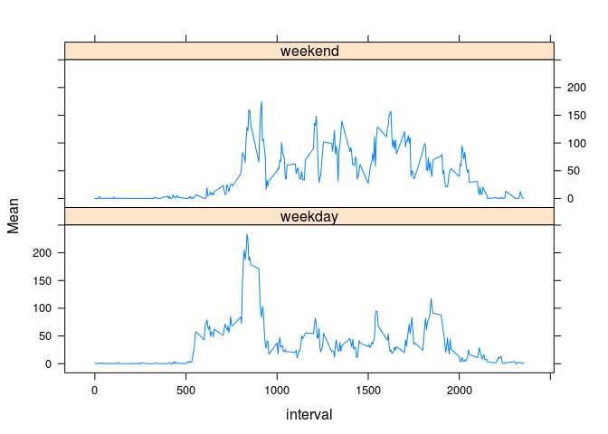

# Reproducible Research: Peer Assessment 1
##Introduction
This report consists of a basic analysis of data collected from a personal activity monitoring device. Data in its initial form has columns "steps" which records the steps taken within a five minute interval, "date" which records the date on which this measurement was made, and "interval" which records which 5 minute interval during that date the measurement was recorded in.


## Loading and Preprocessing
First we load packages which will be required throughout this analyis, then load the activities data into "data" and form a new data set ("data1")" with NA's removed and the "data" column converted to the appropriate format.

```r
#title
library(plyr)
library(lattice)

data<-data<-read.csv("/home/emily/RepData_PeerAssessment1/activity.csv")
x<-!is.na(data$steps)
data1<-data.frame(steps=data$steps[x],date=as.Date(data$date[x]),interval=data$interval[x])
```

## Total  number of steps per day
We now make a data frame "totalSteps" which records how many steps were taken total on each of 53 days and then create a histogram from that data.


```r
totalSteps<-ddply(data1,"date",summarise,total=sum(steps))
hist(totalSteps$total,col="chartreuse3",main="Total Steps per Day")
```

 

So it appears that the total steps per day is roughly normally distributed about some mean, which we can also see in a summary of totalSteps.


```r
summary(totalSteps$total)
```

```
##    Min. 1st Qu.  Median    Mean 3rd Qu.    Max. 
##      41    8841   10760   10770   13290   21190
```

For a more accurate mean and median, we use the relevant functions:

```r
mu<-mean(totalSteps$total)
med<-median(totalSteps$total)
```

We find that the total steps per day of the data with NA values removed has a mean of 1.0766189\times 10^{4} and a median of 10765.

## Average Daily Activity Pattern
Separating the data frame by interval we find the mean number of steps taken for each interval and plot this to see the shape of the average daily activity pattern:


```r
dailyActivity<-ddply(data1,"interval",summarise, Mean=mean(steps))
plot(dailyActivity,ylab="Steps",xlab="Interval (5 minutes)",type="l",main="Average Daily Activity")
```

 

The interval with the maximum mean step value can now be found:

```r
immsv<-dailyActivity$interval[which.max(dailyActivity$Mean)]
```
so the interval with maximum mean step value is 835, with a value of 206.1698113.


## Inputing Missing Values
Until now we have simply ignored the missing values in the original data. We can check the effect this decision had on our previous analysis. The number of NA values in "data" is given by:

```r
sum(is.na(data$steps))
```

```
## [1] 2304
```

We now assume that most of the missing values followed similar patterns to the ones that were recorded. For each missing value we replace it with the mean number of steps taken in that interval on other days,and call this new filled in data frame "dataX".

```r
dataX<-data
dataX$date<-as.Date(dataX$date)
dataX$imeans<-dailyActivity$Mean
x<-is.na(dataX$steps)
dataX$steps[x]<-dataX$imeans[x]
```

We can now make another histogram, and compare it to our original one:  

```r
totalStepsX<-ddply(dataX,"date",summarise,total=sum(steps))
hist(totalStepsX$total,col="chartreuse3",main="Total Steps per Day (Filled in Data)")
```

 

```r
hist(totalSteps$total,col="chartreuse3",main="Total Steps per Day (NAs ignored)")
```

 
  
They are very similarly shaped, with total steps per day for dataX having a larger centre bar - as would be expected given that extra observations were added, all with the most common values.  

We can see the difference that has been made to the mean and median of the data:  

```r
muX<-mean(totalStepsX$total)
muX-mu
```

```
## [1] 0
```

```r
medX<-median(totalStepsX$total)
medX-med
```

```
## [1] 1.188679
```
So the new mean is 1.0766189\times 10^{4} and the new median is 1.0766189\times 10^{4}. These have also changed very little. The mean remains the same as we have filled in means of intervals which are roughly evenly distributed though the data, and the median has increased slightly to be the same as the mean as we added a large amount of intervals with mean type values.

## Differences Between Weekdays and Weekends

We create two data frames from data1, one containing weekend observations, and one containing weekday observations. We use data1 instead of dataX because the filled in NA values in dataX may make weekend and weekdays have more values which are similar to each other, obscuring any differences.

```r
days<-weekdays(data1$date,abbreviate=TRUE)
isweekend<-(days=="Sun") | (days=="Sat")
data1$day[isweekend]<-"weekend"
data1$day[!isweekend]<-"weekday"
dataWE<-subset(data1,data1$day=="weekend")
dataWD<-subset(data1,data1$day=="weekday")
```


We then recalculate the interval means:

```r
thingWE<-ddply(dataWE,"interval",summarise,Mean=mean(steps))
thingWE$day="weekend"
thingWD<-ddply(dataWD,"interval",summarise,Mean=mean(steps))
thingWD$day="weekday"
thingAll<-rbind(thingWE,thingWD)
xyplot(Mean ~ interval | day, data=thingAll, layout=c(1,2),type="l")
```

 
  
There does appear to be a difference in average daily activity patterns between weekends and weekdays. Activity is spread out reasonably evenly from about interval 750 to 2000 on weekends, while on weekdays there is a sharp peak at about interval 800 with significantly less throughout the remainder of the day.
